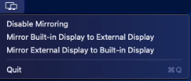

# ToggleMirrorDisplay
A MacOS menu bar app to change display mirroring options. App is not signed because I don't have a developer account, so you'll have to dequrantine it and sign it yourself. See: https://gist.github.com/apisandipas/765803fe8a6f8a14fb985b0fb2b87b11. Alternatively, you can clone the repo and build it yourself.\
\

